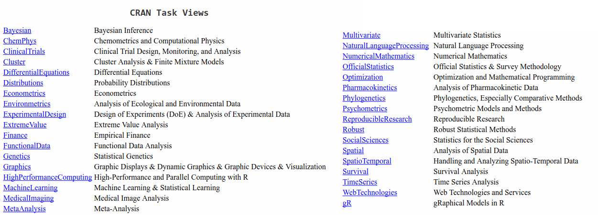
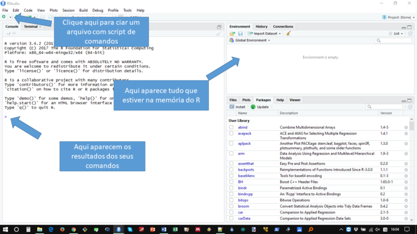
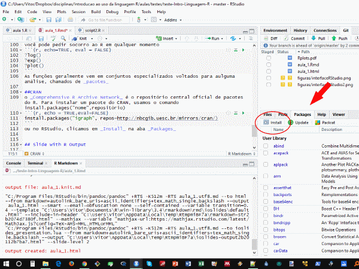
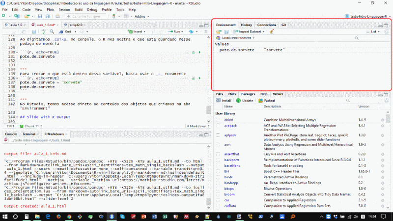

## Bem vindos


## Cronograma
Dia 1  -  21/11 - Introdução, histórico e como usar o R e Rstudio, boas práticas de programação  
Dia 2  -  22/11 - Criando e e manipulando dados, noções de lógica  de programação I  
Dia 3  -  23/11 - Leitura de arquivos, limpeza e manipuação de dados, noções de lógica de programação II  
Dia 4  -  28/12 - Análise exploratória e funções matemáticas  
Dia 5  -  05/12 - Análise estatística básica no R
Dia 6  -  06/12 - Gráficos  
Dia 7  -  07/12 -  
Dia 8  -  12/12 -  
Dia 9  -  13/12 - Programação para iniciantes: da idéia à análise final  
Dia 10 -  14/12 - Versionamento de código: noções de git  

Aulas: teoria (1 a 2 h) + prática (wiki do curso)

# O que é o R?
- R é uma linguagem de programação voltada para análises estatísticas e manipulação de dados
- RStudio é um ambiente de desenvolvimento integrado (IDE) que extende as capacidades do R e facilita o uso
 
##Jeito R de ser
- Praticidade  
- Reprodutibilidade  
- Simplicidade (sim, você leu direito)  

Ao fazer o tratamento e análise dos dados dentro do R, você não altera os dados originais, e pode reproduzir tudo, bastando ter o script e os dados originais. Não é necessário nem salvar os gráficos.


# Porque Usar R? 
- Uma vastidão de pacotes de análises prontas  



***
* **Interfaces amigáveis que não precisam de programação**  
    + RCommander <- fácil acesso às análises principais
    + Action <- análises integradas ao Excel
    + RStudio <-ambiente completo de programação  
  
* Possibilidade de programar suas próprias análises, de acordo com suas necessidades
* Integração com outros softwares
    + GIS
    + Git  **<-- Salvação da humanidade**
    + Excel
    + C++
    + Python
    + Esta aula foi feita em R no RStudio   
 
    

# Primeiros passos no R

## Abrir o RStudio
 

# No RStudio
Digite o comando abaixo na aba console, onde está o caractere  **">"** , e depois tecle **enter**
```{r, echo = TRUE}
4 + 12
```
O resultado aparece logo abaixo, na própria aba, em cor diferente


#O R é uma calculadora completa, tente várias combinações. 
Qualquer texto após \# é ignorado pelo R
```{r echo=TRUE}
1 + 1  # soma
3 - 74 ## subtração
4 * 12 ## multiplicação
3 / 7 ## divisão
```

#O R também aceita comandos mais complicados
```{r, echo = TRUE}
  pi ^ 2 # potência
((4 * 7) + 45) / 2
```
O que está dentro dos parênteses é avaliado de dentro para fora, e o resultado é usado para a operação seguinte, e assim por diante

# Logaritmos, exponenciações, raízes
```{r, echo = TRUE}
log(10, base=2)
exp(1)
sqrt(2)
```


# Funções
Quando temos um nome seguido de parêntese com alguma coisa dentro, temos uma **função**
Função é um conjunto de comandos que faz uma operação em um objeto  
sqrt(x) calcula a raiz quadrada de x  
Funções podem ter opçoes, chamadas argumentos
```{r, echo=TRUE, eval = FALSE}
log(10, base=2)
```
calcula o logaritmo de 10 na base 2  

Quase tudo que vocêe vai usar no R são funções

Muito cuidado com a digitação: para o R, maiúsculas e minúsculas são diferentes, e um espaço no meio da palvra atralha

**O R é burro, qualquer erro de digitação faz com que ele não encontre o que você procura**

#Ajuda das funções
você pode pedir socorro ao R em qualquer momento
```{r, echo=TRUE, eval = FALSE}
?log()
?exp()
?plot()
help(library)
```
As funções geralmente vem em conjuntos especializados voltados para aulguma análise, chamados de _pacotes_

#Outros lugares para pedir ajuda
Quase todos os problemas que você tem com R, alguém já teve e resolveu

Google <- busque por "R manova" ou "R phylogenetics" ou "R cluster analysis", etc.
[Stack Overflow](https://stackoverflow.com/) <- geralmente é o primeiro resultado do Google


#CRAN
o _Comprehensive R Archive Network_ é o repositório central oficial de pacotes do R. Para instalar um pacote do CRAN, usamos o comando install.packages("nome",repositório)
```{r, echo = TRUE,eval=FALSE}
install.packages("igraph", repos=http://nbcgib.uesc.br/mirrors/cran/)
```
ou no RStudio, clicamos em _Install_ na aba _Packages_
 

#Para usar um pacote

```{r echo=TRUE}
library(igraph)

```
agora as funções do _igraph_ estão disponíveis para serem usadas

#Dados e variáveis

#R é uma linguagem de manipulação de objetos
No R, podemos criar caixas para guardar coisas que iremos usar depois, que chamamos de _variáveis_ 
Para isso usamos o sinal _=_ ou _<-_ .   
_<-_ existe por motivos de compatibilidade para teclados que nao possuíam _=_ (lá dos tempos jurássicos da computação). Use _=_

```{r, echo=TRUE}
pote.de.sorvete = "feijão"
```

Na linha acima o R interpreta o que está dentro das apas como texto, e guarda esse valor dentro de um pedaço da memória que recebe o nome "pote.de.sorvete". 

O nome das variáveis não deve conter espaços, acentos,ou caracteres especiais como ç, ~, !, ?, /, |     

Ao digitarmos _pote.de.sorvete_ no console, o R nos mostra o que está guardado nesse pedaço de memória

```{r, echo=TRUE}
pote.de.sorvete
```

#Escolha nomes que façam sentido para suas variáveis
Lembre que você vai ter de ler seus códigos depois, e advinhar o que você quis dizer com _a_, _aa_, _x_, _X_, _a7589_, _MyVar_ e outras bizarrices que pareciam fazer sentido.

Aproveite que o RStudio tem autocompletar!

Para trocar o que está dentro dessa variável, basta usar o _=_ novamente
```{r, echo=TRUE}
pote.de.sorvete = "sorvete"
pote.de.sorvete

```
porque o código baixo nao funciona?
```{r, echo=TRUE,eval=FALSE}
pote .de.sorvete = "chuchu"
```

***
Para ver o que tem na memória do R, use o comando _ls()_
```{r}
ls()
```

No RStudio, podemos ver o conteúdo dos objetos que criamos na aba "Environment"  

 

#Variáveis também podem guardar conjuntos de dados
Chamamos estas variáveis de _vector_ ou _vetor_. Criamos elas com a função _concatenate_, _c()_
```{r, echo=TRUE}
geladeira = c("sorvete","cebola","agua", "miojo","macarrão","pacote.de.ketchup")
geladeira
```

Vetores só guardam objetos iguais: ou texto, ou números, nunca os dois juntos  
Veja o que as funções _seq()_ e _rep()_ fazem!

###Vetor é a unidade básica do R
Quase todas as funções do R são baseadas em manipulação de vetores
```{r, echo=TRUE}
peso.real = c(100, 45, 77, 60)
peso.no.perfil = c(70, 50, 60, 55)
quilos.omitidos = peso.real - peso.no.perfil
quilos.omitidos

```

***
Ao somar, multiplicar, subtrair ou dividir vetores, o R pega os valores na mesma posição e faz a operação em questão

**regra da reciclagem** Quando um vetor é menor que o outro, o R repete o vetor menor até completar o maior

```{r, echo=TRUE}
peso.real = c(100, 45, 77, 60, 50, 77.5)
ganho.apos.almoco = c(2, 5.3)
peso.gordo= peso.real + ganho.apos.almoco
peso.gordo

```

Sempre confira o tamanho dos seus vetores!

#Tamanho e conteúdo dos vetores
Função _length()_ retorna o tamanho do vetor
```{r, echo=TRUE}
peso.real = c(100, 45, 77, 60, 50, 77.5)
length(peso.real)

```
Para acessar o elemento _i_ do vetor, use _nome[i]_
```{r, echo=TRUE}
peso.real = c(100, 45, 77, 60, 50, 77.5)
peso.real[3]
```
***
#Dataframes
Dataframes são o formato de tabela mais comum do R. No dataframe você pode ter colunas com tipos de dados diferentes, como numérico e texto.  
Para criar o dataframe,, temos 3 jeitos principais

#Salvando ~~sua vida~~ seu código
Se você fechar o R, vai perder tudo que você fez  

Solução: salve seu código em um script!  

Script é um arquivo de texto sem formatação, com a extensão _.R_ ou _.r_, ao invés de .txt. Pense no script como a receita, o R como a cozinha, e a análise o jantar.

Você pode editar no bloco de notas, Notepad++, Gedit,Vim, EMACS, etc, mas evite usar Word, ele insere formatações que atrapalham tudo

Use o RStudio!

***


#Mas salvar onde?
O R usa uma coisa chamada diretório de trabalho. Ele encontra automaticamente tudo que esteja nesse diretório e salva as coisas nesse diretório.

```{r echo=TRUE}
getwd() ##exibe o diretório de trabalhoda sessão atual
```

Para mudar o diretório de trabalho, use a função _setwd()_
```{r echo=TRUE, eval=FALSE}
setwd("C:/Curso_R/aula1") ##muda o diretório de trabalho da sessão atual

```
*ATENÇÃO* O endereço deve vir sempre em aspas, e use <span style="color:blue">/</span> ao invés de <span style="color:blue"> \\ </span> no Windows


#Cada coisa, um script!
Separe suas funções e análises em scripts diferentes, vai facilitar _muito_ sua vida.

Use nomes curtos e descritivos. _Funcao1.R, funcao2.R, regressao.R, regressaoLogisticaMultivaridaAmostra1BTSversão1.r_ é pedir pra sofrer. 

*Uma pasta para cada coisa:*  
~/doutorado/
            - /dados  
            - /analises 
            - /figuras
            - /manuscrito

Você pode chamar um script de dentro do outro, usando o comando   _source(endereço/script.R)_. O endereço pode inclusive ser um site

#Criando seu script
Note que o RStudio muda automaticamente as cores do código. Isto é chamado _syntax highlighting_, e serve pra facilitar a leitura. o que cada cor quer dizer?


O Rstudio também insere automaticamente um ), } ou ] quando você digita (, {, ou [, o que diminui a maior parte dos erros de digitação

Crie um script com os codigos que usamos até aqui, comentando cada linha com um _#_ após o comando, dizendo o que ele faz

#Salvando tudo junto
Se você quiser salvar tudo que está na memória do R, use a função _save.image()_, com a extensão _.RData_
```{r eval=FALSE}
 save.image(file="tudoJunto.RData")
```


#Lendo arquivos
##O R consegue ler arquivos externos, se você disser a ele o que esperar
```{r eval=FALSE}
help("read.table")
```
Existem algumas funções com opções padrão que facilitam o uso da _read.table()_

_read.csv()_ lê arquivos usando como padrão o ponto (.) como sepador de decimais e a vírgula (,) como separador de colunas. 

_read.csv2()_ usa a vírgula como separador de decimais e o ponto-e-vírgula (;) como separador de colunas

Existem pacotes específicos para ler e escrever .docx, .xlsx, .pptx, SPSS, SAS, shapefiles, e praticamente qualquer tipo de arquivo

**Uma das principais habilidades para se usar o R é encontrar o pacote certo pra fazer o que você quer**

#Argumentos importantes
```{r, eval=FALSE}
#argumento são sempre separados por vírgulas na chamada da função
#no começo, é bom colocar cada argumento em uma linha para facilitar o entendimento
#TRUE habilita a opção, FALSE desabilita
arquivoLido =read.csv(file = "arquivo.csv", 
                  header = TRUE, #interpreta a primeira linha como sendo o nome das colunas
                  as.is = TRUE , # não altera interpreta o tipo de dado em cada coluna, ou seja, não altera seus dados. Se for FALSE, texto é interpretado como factor
                  sep = ",", # define o caractere que deve ser o separador de colunas
                  dec = ".", #define o caractere que deve ser o spearador de decimal
)
```

O comando acima cria uma variável chamada _arquivoLido_, com o conteúdo de _"arquivo.csv"_  

*O arquivo original não é alterado, não importa o que você fizer dentro do R*

Se você quiser salvar suas alterações em um arquivo, use write.table(), write.csv() ou write.csv2()

```{r, eval=FALSE}

write.csv(x= arquivoLido, #objeto a ser gravado
         file = "arquivoNovo.csv", #nome do arquivo que vai ser gerado
         sep = ",", # define o caractere que deve ser o separador de colunas
         dec = ".", #define o caractere que deve ser o spearador de decimal
)
```
***

