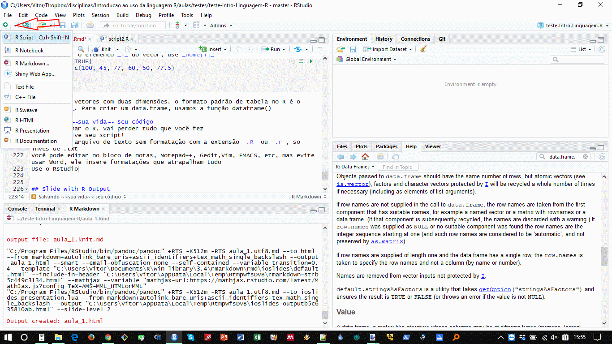

#Salvando ~~sua vida~~ seu código
Se você fechar o R, vai perder tudo que você fez  

Solução: salve seu código em um script!  

Script é um arquivo de texto sem formatação, com a extensão `.R` ou `.r`, ao invés de `.txt`. Pense no script como a receita, o R como a cozinha, e a análise o jantar.

Você pode editar no bloco de notas, Notepad++, Gedit,Vim, EMACS, etc, mas evite usar Word, ele insere formatações que atrapalham tudo

Use o RStudio!

***


#Mas salvar onde?
O R usa uma coisa chamada diretório de trabalho. Ele encontra automaticamente tudo que esteja nesse diretório e salva as coisas nesse diretório.

```{r echo=TRUE}
getwd() ##exibe o diretório de trabalhoda sessão atual
```

Para mudar o diretório de trabalho, use a função `setwd()`
```{r echo=TRUE, eval=FALSE}
setwd("C:/Curso_R/aula1") ##muda o diretório de trabalho da sessão atual

```
<span style="color:red">*ATENÇÃO* </span>  
O endereço deve vir sempre em aspas, e use <span style="color:blue">/</span> ao invés de <span style="color:blue"> \\ </span> no Windows


#Cada coisa, um script!
Separe suas funções e análises em scripts diferentes, vai facilitar _muito_ sua vida.

Use nomes curtos e descritivos. `Funcao1.R, funcao2.R, regressao.R, regressaoLogisticaMultivaridaAmostra1BTSversão1.r`é pedir pra sofrer. 

*Uma pasta para cada coisa:*  
~/doutorado/   
            - /dados   
            - /analises  
            - /figuras   
            - /manuscrito  

Você pode chamar um script de dentro do outro, usando o comando   `source(endereço/script.R)`. O endereço pode inclusive ser um site.  
<span style="color:red">*ATENÇÃO* </span>  
`source(script.R)` executa todos os comandos que estão dentro de `script.R`, cuidado

Crie um script com os codigos que usamos até aqui, comentando cada linha com um `#` após o comando, dizendo o que ele faz

***
#Dica de estruturar seu script: pseudocódigo
Liste cada passo necessário

  verbo - objeto

- Ler dados do arquivo
- Verificar dados ausentes / errados
      - verificar NAs
      - verificar erros de digitaçãoo
      - verificar cabeçalhos
- Selecionar colunas para analisar
- Rodar análise
      - Passo 1
      - Passo 2
  _ ....

***
# Pseudocódigo
Substitua a ação pela função adequada do R  
Se necessário, quebre em sub itens

- Ler dados do arquivo
    - `file = read.table("preçosComida.csv")`
- Verificar dados ausentes / errados
      - verificar NAs
        - `is.na(file)`
      - verificar erros de digitação
        - `unique(file$species)`
      - verificar cabeçalhos
        - `head(file)`
- Selecionar colunas para analisar
      - `file$species[file$species!="Chuchu"]`
- Rodar análise
      - Passo 1
        - `lm(file$price ~ file$species)`
      - Passo 2
  _ ....

***

#Salvando tudo junto
Se você quiser salvar tudo que está na memória do R, inclusive objetos use a função `save.image()` com a extensão `.RData`
```{r eval=FALSE}
 save.image(file="tudoJunto.RData")
```
Isto é útil quando temos uma analise demorada, que gera objetos grandes, e queremos acessar o resultado dela rapidamente no futuro. Podemos também salvar objetos específicos com a função `save()`:
```{r eval=FALSE}
save(file="resultadosSalvos.RData",list = list(resultado1, resultado2, resultado3))
```
Em geral, é melhor salvar os scripts do que o workspace ou os objetos

#Lendo arquivos do R
Abrir um arquivo, carregar um arquivo e executar um arquivo são coisas diferentes.

Abrir -> ver os conteúdos  
      - pode ser no editor do R, RStudio, ou externo  
      - não executa nem carrega nada  
Executar -> rodar os comandos dentro do arquivo  
      - função `source()`   
Carregar -> colocar o conteúdo do arquivo para dentro de um objeto  
      - funções `load(), read.table(), read.csv()` e etc  


***
#Função `list.files()`
Lista todos os arquivos no diretório de trabalho. Pode ser usada para selecionar um grupo de arquivos que serão lidos sequencialmente, por exemplo, com o argumento `pattern` para selecionar arquivos que contenham uma determinada sequencia no nome

Atenção: apenas lista, não carrega nem abre os arquivos
```{r}
list.files()
```
***
```{r}
aulas = list.files(pattern = "aula") # arquivos que possuam "aula"" em qualquer lugar do nome
aulas
scripts = list.files(pattern = "\\.R$") # "\\.R$" significa arquivos terminados em .R
scripts # objeto contendo os nomes dos arquivos, não os conteúdos
```

***
#Executar arquivos
Usamos a função `source()` para executar o conteúdo de um arquivo de código. Especialmente útil para carregar funções específicas ou scripts de análise.
```{r}
ls()
source("arquivos/toroidal.distance.R")
ls()
```

***
```{r}
toroidal.distances
```
***
#Carregando arquivos
Usamos a função `load()` para carregar arquivos criados com as funções `save(), save.image()`
```{r eval=FALSE}
load(file="resultadosSalvos.RData")
ls()
```

#Lendo arquivos quaisquer
##O R consegue ler arquivos externos, se você disser a ele o que esperar
```{r eval=FALSE}
help("read.table")
```
`read.table()` é especializada em ler tabelas em formato texto

Salvar os dados em formato texto facilita leitura, backup e compatibilidade com versões anteriores e posteriores de programas (.xls / .xlsx)  
    - arquivos de texto são entendidos automaticamente por software de versionamento (aula 9)

Existem algumas funções com opções padrão que facilitam o uso da `read.table()`

`read.csv()` lê arquivos usando como padrão o ponto `(.)` como sepador de decimais e a vírgula `(,)` como separador de colunas. 

`read.csv2()` usa a vírgula como separador de decimais e o ponto-e-vírgula `(;)` como separador de colunas

Existem pacotes específicos para ler e escrever .docx, .xlsx, .pptx, SPSS, SAS, shapefiles, e praticamente qualquer tipo de arquivo

**Uma das principais habilidades para se usar o R é encontrar o pacote certo pra fazer o que você quer**

#Argumentos importantes
```{r, eval=FALSE}
#argumentos são sempre separados por vírgulas na chamada da função
#no começo, é bom colocar cada argumento em uma linha para facilitar o entendimento
#TRUE habilita a opção, FALSE desabilita
arquivoLido =read.csv(file = "arquivo.csv", 
                  header = TRUE, #interpreta a primeira linha como sendo o nome das colunas
                  as.is = TRUE , # não altera interpreta o tipo de dado em cada coluna, não altera seus dados. Se for FALSE, texto é interpretado como factor
                  sep = ",", # define o caractere que deve ser o separador de colunas
                  dec = ".", #define o caractere que deve ser o spearador de decimal
)
```

O comando acima cria um objeto chamado `arquivoLido`, com o conteúdo de `"arquivo.csv"`  

*O arquivo original não é alterado, não importa o que você fizer dentro do R*

Se você quiser salvar suas alterações em um arquivo de texto, use `write.table()`, `write.csv()` ou `write.csv2()`  

```{r, eval=FALSE}

write.csv(x= arquivoLido, #objeto a ser gravado
         file = "arquivoNovo.csv", #nome do arquivo que vai ser gerado
         sep = ",", # define o caractere que deve ser o separador de colunas
         dec = ".", #define o caractere que deve ser o spearador de decimal
)
```
***
#Importantíssimo
Nunca jamais use o Word ou Docs para editar arquivos de texto puro   
Nunca use acentos, espaços, parênteses, colchetes, símbolos ou caracteres especiais no nome dos arquivos ou nomes de colunas/objetos, pois eles tem significados especiais no R   

Para escrever e salvar em tabelas do Excel, use os pacotes `writexl` e `readxl`

```{r, eval=F}
library(writexl)
library(readxl)
write_xlsx(mtcars , "mtcars.xlsx")
out <- read_xlsx("mtcars.xlsx")
```

