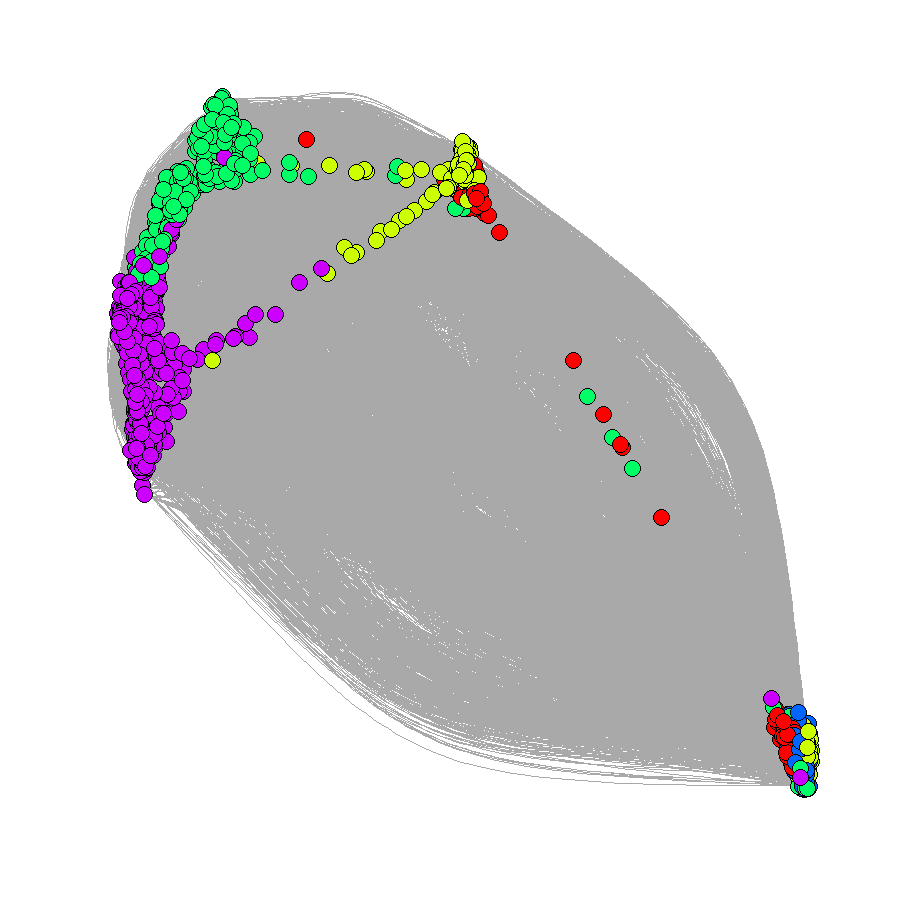
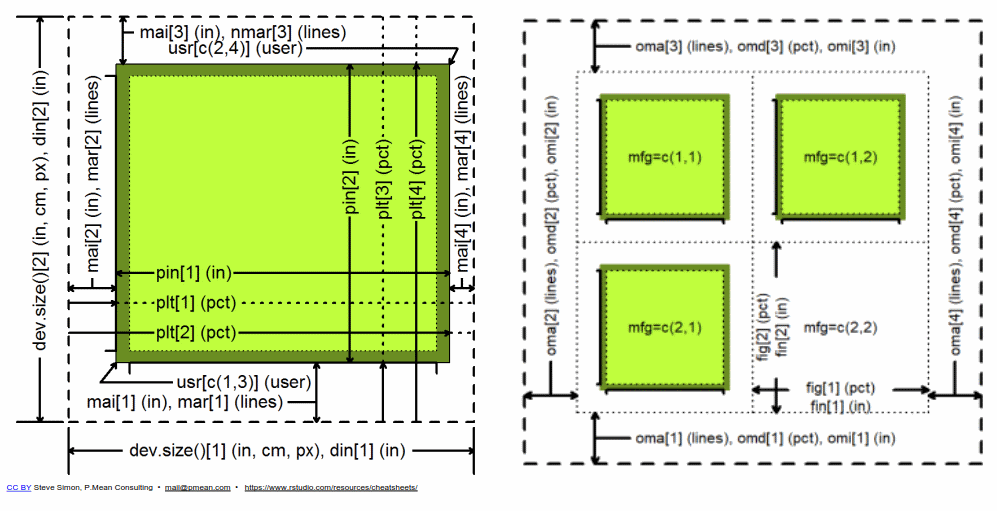

#Visualizar seus dados pode ser a parte mais importante da  sua análise
Fazer gráficos no R pode dar (muito) trabalho, mas os resultados valem a pena  

Gráficos no R são baseados em dispositivos. O dipositivo padrão é a tela, mas podem ser arquivos, cada tipo de arquivo gráfico sendo um dispositivo diferente

No RStudio, gráficos são plotados na aba plots, mas podem ser abertos em janelas separadas, usando a função `x11()` (Linux e Windows), `windows()` (Windows somente) ou `quartz()` (Macintosh)


Os tipos padrão de gráficos disponíveis são
`postscript()` para arquivo postscript, extensão `.ps` ou `.eps`  
`pdf()` salva o gráfico num arquivo `.pdf`  
`pictex()` salva o gráfico no formato LaTeX/PicTeX  
`xfig()` salva o gráfico no formato `.XFIG`  
`bmp()`, `bitmap()` salva um arquivo `.bitmap` (precisa de GhostScript instalado).  
`X11()` plota numa janela via sistema gráfico X11  
`png()` salva o gráfico no formato `.PNG`
`tiff()` salva o gráfico no formato `.tiff` 
`jpeg()` salva o gráfico no formato `.jpg` 
`svg()` salva o gráfico no formato `.svg`  
<style>
  .col2 {
    columns: 2 200px;         /* number of columns and width in pixels*/
    -webkit-columns: 2 200px; /* chrome, safari */
    -moz-columns: 2 200px;    /* firefox */
  }
  .col3 {
    columns: 3 100px;
    -webkit-columns: 3 100px;
    -moz-columns: 3 100px;
  }
</style>
***
#Gravando o gráfico num arquivo
```{r, eval=FALSE}
# Chame o tipo de arquivo desejado, passando informações de tamanho, resolução, tipo de fonte, e nome de arquivo
png("SocialNetworkExample.png",width = 900,height = 900)

#plote seu gráfico normalmente, ele será escrito no arquivo e não irá aparecer na tela
plot(graph.subset,
     layout= layout_nicely(graph=graph.subset),
     vertex.label=NA,
     vertex.color=colors[membership(graph.subset.modulos)],
     vertex.size = 5,
     )
#feche o dispositivo, usando dev.off(), senão o arquivo ficará corrompido
dev.off()
```
***


***

Função básica e poderosa (e feia): `plot()`
<div class="col2">
```{r}
plot(x= iris$Sepal.Length, y=iris$Petal.Length,col=iris$Species)
```

```{r}
library(ggplot2) #pacote especial para fazer graficos, com interface mais amigavel
qplot(x= iris$Sepal.Length, y=iris$Petal.Length, color=iris$Species)
```
</div>
***
#A função `plot()` tem dezenas de opções para controlar cada detalhe mínimo do gráfico
Principais:
- x
- y
- type
- main
- xlab
- ylab
- xlim
- ylim
xaxt
bty
pch
cex


```{r table1, echo=FALSE, message=FALSE, warnings=FALSE, results='asis'}
tabl <- "  
| Parâmetro        | Controla           | valores      |
|---------------|-------------|-----------:|
| x      | valores a serem plotados em x  |       |
| y      | valores a serem plotados em x  |       |
| type   | tipo de gráfico (ponto, linhas, etc)| \"p\",\"l\",\"b\"... |
| lty   | tipo de linha (pontilhada, tracejada, etc)| \"blank\", \"solid\", \"dashed\", \"dotted\", \"dotdash\", \"longdash\", ou \"twodash\" |
| pch   | tipo de ponto (bola, triangulo, quadrado, etc)| \"p\",\"l\",\"b\"... |
| col   | cor dos símbolos| \"red\", \"black\", \"1\", RGB|
| col.axis, col.lab, col.main| cor dos textos| \"red\", \"black\", \"1\", RGB|
"
cat(tabl)
```

***
```{r table2, echo=FALSE, message=FALSE, warnings=FALSE, results='asis'}
tabl <- "  
| Parâmetro        | Controla           | valores      |
|---------------|-------------|-----------:|
| main   | título do gráfico                |    \"texto entre aspas\" |
| xlab   | rótulos do eixo x                |  \"texto entre aspas\"  |
| ylab   | rótulos do eixo y              |   \"texto entre aspas\"  |
| cex   | tamanho das letras, em proporção|   cex = 1 -> 100%, cex = 0.5 ->50%, etc  |
| cex.axis, cex.lab, cex.main   | eixos, rotulos dos eixos, título|   cex.axis = 1 -> 100%, cex.axis = 0.5 ->50%, etc  |
| bty   | linhas de contorno do gráfico   |   \"o\", \"l\", \"7\", \"c\", \"u\",  \"]\", \"n\"  |
| ylab   | rótulos do eixo y              |   \"texto entre aspas\"  |
| ylab   | rótulos do eixo y              |   \"texto entre aspas\"  |

"
cat(tabl)
```

***
#Função `par()` e função `axis()`
`par()` estabelece os parâmetros para todos os gráficos que se seguem a ela exceto parâmetros de intervalo de dados a serem plotado. Usada para definir gráficos com vários painéis, margens e área do gráfico. Usada antes de qualquer `plot()`

`axis()` define todos os parâmetros para os eixos, usada depois de `plot(dados, xaxt = "n")` (para eixo x) ou `plot(dados, yaxt = "n")` (para eixo y) 
```{r}
par(mfrow=c(1,2))      #linhas, colunas

plot(x=iris$Sepal.Length, y=iris$Petal.Length,        #primeiro gráfico
     col = iris$Species,                          
     main = "Sepal.Length x Petal.Length")     

plot(x=iris$Sepal.Length, y=iris$Sepal.Width,         #segundo gráfico
     col = iris$Species,                          
     main = "Sepal.Length x Sepal.Width in Iris")      
```

***


***
#Funções que adicionam elemento a gráficos
`abline()` adiciona uma linha, definida por intercepto e inclinação, ou por valores de posição horizontal (h)  e vertical (v)  


`segments((x0, y0, x1, y1)`  adiciona um segmento indo de (x0,y0) até (x1,y1)  


`arrows(x0, y0, x1 , y1 , length, angle = 30)` adiciona uma seta a um gráfico. `length`é o comprimento da seta e `angle` é o angulo da ponta da seta  


`points(x, y, pch)` adiciona pontos nas coordenadas x e y. `pch` é o tipo de simbolo utilizado  

***
<div class="col2">
```{r,echo=F}
Idade = c(3.0, 4.0, 5.0, 6.0, 8.0, 9.0, 10.0, 11.0, 12.0, 14.0, 15.0, 16.0, 17.0)
TamanhoDaAsa = c(1.4, 1.5, 2.2, 2.4, 3.1, 3.2, 3.2, 3.9, 4.1, 4.7, 4.5, 5.2, 5.0)
par.old=par()
modelo=lm(TamanhoDaAsa ~ Idade)
```

```{r,echo=T}
plot(TamanhoDaAsa ~ Idade, xlab = "Idade (décadas)",  
     ylab = "Comprimento (metros)",  
     main = "Tamanho da asa"  
     , bty = "n"  
     , xlim = c(0, 23), ylim = c(0, max(TamanhoDaAsa))  
     , lwd = 2  
)  
abline(modelo, col = "red", lwd = 2) 
```

```{r,echo=T}
modelo=lm(TamanhoDaAsa ~ Idade)
par(bty = "n" , lwd = 2)
plot(TamanhoDaAsa ~ Idade, xlab = "Idade (décadas)",  
     ylab = "Comprimento (metros)",  
     main = "Tamanho da asa"  
     , xlim = c(0, 23)  
     , ylim = c(0, max(TamanhoDaAsa)) 
     , yaxt = "n"  # "n" não plota o eixo, pois iremos alterá-lo com axis()
     , xaxt = "n"
)  
axis(1, pos = 0)  
axis(2, pos = 0, las=2)  
abline(modelo, col = "red", lwd = 2) 
```
</div>

***
```{r}
plot(modelo)  
 
```

***
#Para plotar médias com barras de desvio padrão

```{r,echo=F}
vacas = c(121.72355, 103.79754, 130.15442, 98.29305, 103.43365, 102.44998,
          125.49993, 111.07215, 113.74047, 103.16081, 80.87149, 98.66692,
          65.09549, 155.74965, 88.30168, 147.43610, 114.60806, 109.87433,
          149.54772, 83.54137
          )
fazendeiros = c(77.91352, 78.07251, 81.95604, 75.64862, 78.45213, 79.11058,
                79.98952, 79.18127, 84.01635, 74.86860, 82.01886, 78.26936,
                77.94691, 78.75372, 77.64901, 77.64097, 77.19803, 72.48175,
                83.45336, 78.99681
)
virgens = c(127.9366, 201.7158, 136.1366, 136.5880, 131.7213, 118.1486, 
            125.7534, 139.6544, 163.5890, 139.7455, NA, 141.4450, 110.7311,
            157.5921, 176.8437, 102.8659, 121.8286, 134.7097, 157.1392, 166.7133
)
aventureiros = c(191.3721, 216.1671, 165.4380, 196.2730, 172.6565, 178.2955,
                 193.6687, 189.7674, 160.2968, 208.4400, 204.0934, 208.1798,
                 186.6380, 193.9446, 197.3650, 198.6853, 213.8838, 210.1881,
                 209.9109, 210.9228
)
alimento=c(rep("vacas",20),rep("fazendeiros",20)
           ,rep("virgens",20),rep("aventureiros",20))
dragoes = data.frame(x=alimento, y=c(vacas,fazendeiros,
                                     virgens,aventureiros))
```

```{r}
m1=mean(dragoes$y[dragoes$x=="aventureiros"]);m2=mean(dragoes$y[dragoes$x=="fazendeiros"])
m3=mean(dragoes$y[dragoes$x=="vacas"]);m4=mean(dragoes$y[dragoes$x=="virgens"],na.rm = T)
s1=sd(dragoes$y[dragoes$x=="aventureiros"]);s2=sd(dragoes$y[dragoes$x=="fazendeiros"])
s3=sd(dragoes$y[dragoes$x=="vacas"]);s4=sd(dragoes$y[dragoes$x=="virgens"],na.rm = T)
avg=c(m1,m2,m3,m4)
sdev=c(s1,s2,s3,s4)
plot(x= 1:4, y= avg,cex=1.5,pch=16, col=1:4,ylim=range(c(avg-sdev, avg+sdev)))
arrows(x0=1:4, y0=avg-sdev, x1=1:4, y1=avg+sdev, length=0.05, angle=90, code=3)
abline(h=mean(avg), col="red")#media total
```


***
#Boxplot

```{r}
boxplot(dragoes$y ~ dragoes$x, col=rainbow(length(dragoes$x)))
```

***
A função boxplot permite comparar os intervalos de confiança 95% das medianas: se os entalhes não se sobrepuserem, há forte evidência de que as medianas são diferentes
```{r}
boxplot(dragoes$y ~ dragoes$x, notch=T)
```

***
```{r, eval=FALSE}
files_to_read=list.files(pattern = reg.exp)
if (length(files_to_read)!=0)
{
  for (r in 1:(length(files_to_read)))
  {temp_valores_replicas[,r] <- read.table(files_to_read[r],  header = FALSE)}
  graphtype=NA#creating plot names
  if(type=="g"){graphtype=" with general recognition "}
  if (type=="i") {graphtype=" with Individual Recognition "}
  if (type=="nr") {graphtype=" with No Recognition "}
  plotname =paste(metrica,graphtype, ", mundo = ", world_size, ", mem length = ", as.numeric(mem_length), ", mem modifier = ", as.numeric (modifier),".tiff", sep = "")
  if("plots"%in%dir()==FALSE) dir.create("plots") #se não existir, cria diretorio /plots
  #C:/Users/Vitor/Desktop/100replicas/resultados
  filename = file.path("C:", "Users", "Vitor","Desktop", "100replicas", "resultados", "plots" ,plotname)
  
  tiff(filename ,width = 7.5 ,height = 5,units = "in"
       ,res=300, compression = "lzw",type="cairo", antialias = "default"
       )
  y=max(temp_valores_replicas,na.rm = TRUE)+1
  par(mar=c(4,5,1,2)+0.1)
  plot( #plota primeira linha
    temp_valores_replicas[,1]
    , ylim=c(-1,y)
    , xlab = "Time steps", ylab = metrica, type="l"
    ,bty="l",family="Arial",cex.lab=1.5
  )
  for (p in 2:ncol(temp_valores_replicas))
  {lines(temp_valores_replicas[p],col=p)} #plota resto das linhas
  dev.off()
}
```