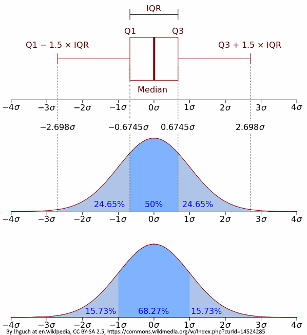

# Função subset()
Divide um objeto em subconjuntos

`x` = objeto a ser dividido  
`subset` = condição lógica indicando o que deve ser mantido  
`select`= indica as colunas a serem selecioandas em um dataframe  
```{r}
dragoes_completo <- read.csv("..//..//arquivos/dragoes_completo.csv", sep=";")
vermelhos.grandes = subset(
  x=dragoes_completo
  ,subset = tamanho_asa >= 15 & cor == "vermelho" #subconjunto somente com vermelhos acima de 15 metros
  , select=n_chifres:idade #manter apenas a coluna n_chifres
  )
vermelhos.grandes
```


***
# Familia apply()
Existem várias funções no R que aplicam funções sobre objetos, e elas variam principalmente no tipo de objeto que devolvem

## Função apply()

Aplica uma funçao a todas as linhas ou todas as colunas de um array (dataframe numérico ou matriz), retorna um vetor ou matriz
<span style="color:red">*ATENÇÃO* </span>: só funciona para dados numéricos, não serve para fatores  
`apply(X, MARGIN, FUN, ...)`  
`x` é array que ser quer agrupar  
`MARGIN` 1 = linhas, 2 = colunas, c(1,2), ambos  
`FUN` é a função que se quer aplicar nas margens, sem parênteses  
`...` são os argumentos que serão passados para a função `FUN`  
Por exemplo, se queremos a soma de cada coluna  
```{r}
numericos= data.frame(dragoes_completo$peso,dragoes_completo$n_chifres,dragoes_completo$tamanho_asa,dragoes_completo$idade)
somas = apply(numericos, MARGIN = 2, FUN =  sum, na.rm=T)
```

***
#Função lapply()
Aplica uma função a cada elemento de uma lista, e retorna uma lista. Pode lidar com qualquer tipo de dado, a depender de `FUN`  
`lapply(X, FUN, ...)`  
`X` um lista ou objeto que será convertido em lista (pode ser data.frame ou matriz)  
`FUN` é a função que se quer aplicar nos elementos de, sem parênteses   
`...` são os argumentos que serão passados para a função `FUN`  
```{r}
lista.somas = lapply(numericos, FUN =  sum, na.rm=T)
lista.somas
lista.log = lapply(numericos, FUN =  log)

```
***
#Função sapply()
Aplica uma função a cada elemento de uma lista, e retorna uma vetor com os resultados.   Pode lidar com qualquer tipo de dado, a depender de `FUN`  
`lapply(X, FUN, ...)`  
`X` um lista ou objeto que será convertido em lista (pode ser data.frame ou matriz)  
`FUN` é a função que se quer aplicar nos elementos de `X`, sem parênteses  
`...` são os argumentos que serão passados para a função `FUN`  
```{r}
vetor.somas = sapply(numericos, FUN =  sum, na.rm=T)
vetor.somas
vetor.log = sapply(numericos, FUN =  log)

```

***
#Função tapply()
`tapply(X, INDEX, FUN, ...)`   
Aplica uma função a subsets do objeto  
`X` = um objeto, tipicamento um vetor  
`INDEX` uma lista de fatores, com comprimento igual a `X`, usado para criar subconjuntos nos quais `FUN` será aplicada  
`FUN` é a função que se quer aplicar nos elementos de `X`, sem parênteses  
`...` são os argumentos que serão passados para a função `FUN`  

```{r}
x <- 1:20
y <- factor(rep(letters[1:5], each = 4))
tapply(x, INDEX=y, FUN = sum)

media.por.cor2=tapply(dragoes_completo$n_chifres, INDEX = dragoes_completo$cor, FUN = mean)
class(media.por.cor2)
```

***
# Para facilitar:
- apply: genérica: aplica uma função a linhas ou colunas de uma matriz (ou às dimensões de um array), retorna vetor ou matriz  
- lapply: "list apply". Age em uma lista ou vetor e retorna uma lista  
- sapply: "simple lapply". Igual a lapply, mas retorna um vetor ou matriz sempre que possível  
- tapply: "tagged apply". subconjuntos (tags) identificam os grupos nos quais a função será aplicada. Tipo de retorno depende da função, geralmente array  
- aggregate: tapply que converte o resultado para dataframe  

Na maioria dos casos você vai usar aggregate ou tapply  

***
# Análise exploratória: verificando seus dados
Antes de qualquer análise estatística, é necessário verificar a distribuição dos dados, se há outliers, se a distribuição é normal, assimétrica, se há dados ausentes, erros de digitação, se as premissas dos testes são cumpridas, se é necessário transformar os dados, etc...

## Antes de tudo, verifique a estrutura dos dados, NAs e erros de digitação
```{r}
str(dragoes_completo)
```
***
```{r}
head(dragoes_completo)
```
***
```{r}
sum(is.na(dragoes_completo))
```
***
```{r}
summary(dragoes_completo)
```
***
Precisamos remover a linha com NA e os erros de digitação
```{r}
unique(dragoes_completo$cor)
dragoes_limpo = dragoes_completo #copie seus dados para um outro objeto
dragoes_limpo=dragoes_limpo[,-1] #coluna 1 é inútil
dragoes_limpo$cor[dragoes_limpo$cor =="dorado" ] = "dourado"
dragoes_limpo$cor[dragoes_limpo$cor =="vremelho" ] = "vermelho"
dragoes_limpo$cor[dragoes_limpo$cor =="banco" ] = "branco"
dragoes_limpo$cor = tolower(dragoes_limpo$cor) # maiúsculas para minusculas
unique(dragoes_limpo$cor)
dragoes_limpo$cor = factor(dragoes_limpo$cor)#transformando novamente em fator
dragoes_limpo = dragoes_limpo[!is.na(dragoes_limpo$peso),]
unique(dragoes_limpo$cor)
```


***
# summary() para estatísticas básicas
```{r}
summary(dragoes_limpo)

```

***
Essas estatísticas são suficientes? Para cada coluna, summary nos dá  
 - Min.     : valor mínimo dos dados  
 - 1st Qu.  : primeiro quartil  
 - Median   : mediana  
 - Mean     : média  
 - 3rd Qu.  : terceiro quartil  
 - Max.     : valor máximo dos dados  
 - NA's     : quantidade de NAs nos dados  
O que falta?  

***


***
# Para conseguirmos outras estatísticas, usamos as funções da família apply
```{r}
sds = lapply(X = dragoes_limpo,FUN = sd ,na.rm=T ) #sd não funciona para fatores
sds
```

***
também podemos usar funcões que nós mesmo escrevemos
```{r}
erro.padrao.media = function(x) {
  #erro padrão da média, é igual ao desvio padrão dividido pela raiz do número de amostras
                                  sd(x)/sqrt(length(x))
}
erros = aggregate(dragoes_limpo$idade
               ,by=list(dragoes_limpo$dieta)
               ,FUN = erro.padrao.media
                              )

erros
```

# Detectando outliers: Cleveland dotplot
Arruma os pontos de acordo com o valor (eixo x), e a ordem nos dados (eixo y)
```{r}
par(mfrow=c(1,2))
boxplot(dragoes_limpo$tamanho_asa)
dotchart(dragoes_limpo$tamanho_asa)

```

***
```{r}
fazendeiros = c(77.91352, 78.07251, 81.95604, 75.64862, 78.45213, 79.11058,
                79.98952, 79.18127, 840.1635, 74.86860, 82.01886, 78.26936,
                77.94691, 78.75372, 77.64901, 77.64097, 77.19803, 72.48175,
                83.45336, 78.99681
)
par(mfrow=c(1,2))
boxplot(fazendeiros)
dotchart(fazendeiros)

```

***
# Homogeneidade da variância
Teste de Bartlett ou de Levene (mais robusto, pacote `car`)
```{r}
library(car)
leveneTest(dragoes_limpo$peso ~dragoes_limpo$dieta)
```

***
ou observando os resíduos
```{r}

plot(lm(dragoes_limpo$peso ~dragoes_limpo$idade))
```

***
# Premissas de normalidade
```{r}
par(mfrow = c(4,4))
plot(dragoes_limpo$peso)
hist(dragoes_limpo$peso, prob=T)
lines(density(dragoes_limpo$peso),col="blue")#densidade probabilística dos dados
plot(dragoes_limpo$n_chifres)
hist(dragoes_limpo$n_chifres, prob=T)
lines(density(dragoes_limpo$n_chifres),col="blue")#densidade probabilística dos dados
plot(dragoes_limpo$tamanho_asa)
hist(dragoes_limpo$tamanho_asa, prob=T)
lines(density(dragoes_limpo$tamanho_asa),col="blue")#densidade probabilística dos dados
plot(dragoes_limpo$idade)
hist(dragoes_limpo$idade, prob=T)
lines(density(dragoes_limpo$idade),col="blue")#densidade probabilística dos dados
```

***
## qqnorm() é uma investigação rápida de normalidade da variável
qqnorm()
```{r}
qqnorm(dragoes_limpo$tamanho_asa) #plota os dados contra uma distribuição normal
qqline(dragoes_limpo$tamanho_asa) #plota uma linha para facilitar a comparação. se as distribuições forem  exatamente iguais, todos os pontos caem em cima da linha
```
***
```{r}
qqnorm(dragoes_limpo$peso)
qqline(dragoes_limpo$peso)
```

***
# qqplot() compara duas distribuições qualquer
```{r}
qqplot(dragoes_limpo$tamanho_asa,dragoes_limpo$peso)

```

***
# Funções matemáticas para gerar distribuições de dados
Usadas para gerar dados artificais com as propriedades desejadas. O R possui as seguintes distribuições por padrão: beta, binomial, Cauchy, qui-quadrado, exponencial, F, gamma, geométrica, hipergeométrica, log-normal, multinomial, binomial negativa, normal, Poisson, t de Student, uniforme, Weibull
```{r}
#distribuição normal
rnorm(n, mean = 0, sd = 1) #gera n observações amostradas de uma normal de media 0 e sd 1
dnorm(3, mean = 0, sd = 1, log = FALSE)# retorna a probabilidade de um valor x, com media 0 e sd 1
pnorm(q, mean = 0, sd = 1, lower.tail = TRUE, log.p = FALSE) # retorna a probabilidade acumulada de que um numero aleatório seja menor que q (usada para encontrar o valor de p<=0,05)
qnorm(p, mean = 0, sd = 1, lower.tail = TRUE, log.p = FALSE) # retorna o valor correspondente a uma probabilidade acumulada p

```

